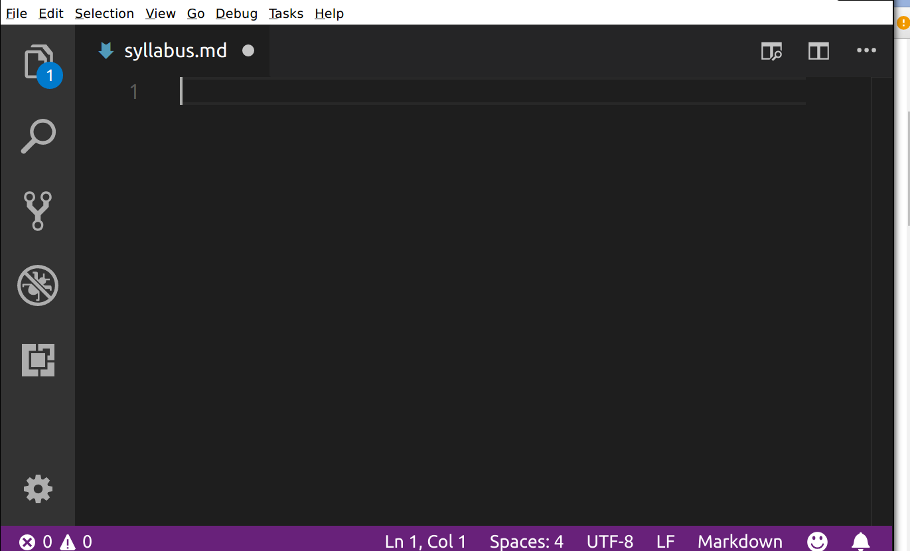
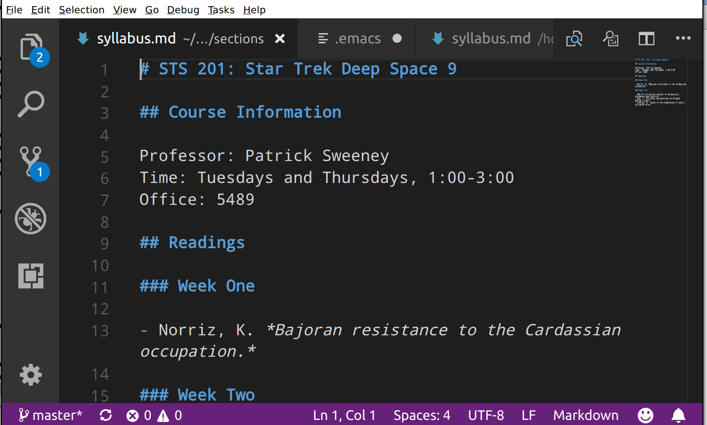
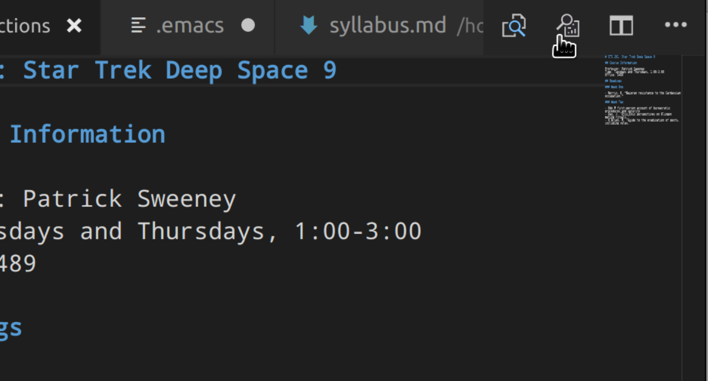
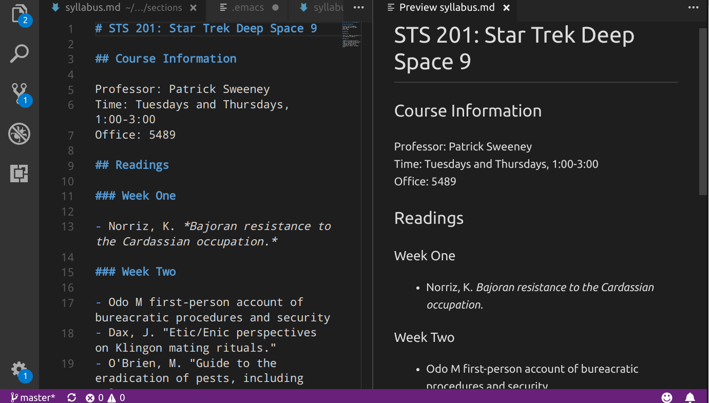

[<<< Previous](gitconfig.md) | [Next >>>](gitaction.md)

# Creating a Syllabus with Markdown

Using `cd`, navigate to the `git-practice` folder inside `projects`. From your home directory, type:

	cd Desktop/projects/git-practice

Now we're going to **initialize** our repository, which means telling Git to pay attention to it:

	git init

You should see output like this:

	Initialized empty Git repository in /home/patrick/projects/git/.git/
	
Now Git is tracking our directory. But before that's useful, we'll have to create a text file for Git to track. For this session, the file we'll track will be a course syllabus—we'll create that next.

### Creating a Syllabus in Markdown

To create a plain text file, we're going to switch to our text editor, VS Code, to create and edit a file named `syllabus.md` and save it to our 'git-practice' folder. If you have not installed VS Code, review [the installation instructions here](https://github.com/DHRI-Curriculum/install/blob/master/sections/vscode.md).

In terminal, check to make sure you are in your `git-practice` folder. (HINT: use 'pwd' to see what directory you are currently in) Next, type:

	code syllabus.md
	
to open a `syllabus.md` file in VS Code. You should see a window appear that looks similar to this:

If VS Code does not open when you use the `code` command in your terminal, open it using the Start Menu on Windows or Spotlight Search on Mac OS as you would any other software. Then click `File > Open File` and use the dialog to navigate to the `/Users/<your-name>/Desktop/projects/git` folder and create a `syllabus.md` file there.

We'll be typing our markdown into this VS Code window. At any time, you can save your file by hitting `Control-s` on Windows or `⌘-s` on Mac OS. Alternatively, you can click the `File` menu on the top right, then select `Save` from the dropdown menu.

## Using Markdown

We'll be using markdown to create a syllabus, and then using Git to track any changes we make to it. Markdown allows us to format textual features like headings, emphasis, links, and lists in a plain text file using a streamlined set of notations that humans can interpret without much training. Markdown files usually have a `.md` extension.

In markdown, we insert headings with a single hash mark like this:

	# My Syllabus Heading
	
A sub-heading (H2) heading uses two hash marks like this:

	## Readings
	
To provide emphasis, place asterisks around some text:

	*This text will appear italicized.*
	**This text will appear bold.**

For emphasis, you need to mark where it should start and where it should end, so you need astrisks at the beginning and end of whatever text is being emphasized. 	

To create a bulleted list, put a hyphen at the beginning of each list item:

	- Reading one
	- Reading two
	- Reading three
	
To create a link, put the anchor text (the text you will see) in square brackets and the URL in parentheses. Don't put a space between them:

	I teach at [The Graduate Center, CUNY](https://www.gc.cuny.edu).
	
Paragraphs of text are denoted by putting a blank line between them:

> This is a paragraph in markdown. It's separated from the paragraph below with a blank line. If you know HTML, it's kind of like the \
 tag. That means that there is a little space before and after the paragraph when it is rendered.
> 
> This is a second paragraph in markdown, which I'll use to tell you what I like about markdown. I like markdown because it looks pretty good, if minimal, whether you're looking at the rendered or unrendered version. It's like tidy HTML.

Try using these five elements—headings, emphasis, lists, links, and paragraphs—to create a syllabus. Have a main heading that gives the course title (one `#`), then subheadings for, at least, course info and readings. Use emphasis (`*`) for book titles and try to get a list in there somewhere.

You can look at an example syllabus in raw text form [here](https://raw.githubusercontent.com/DHRI-Curriculum/git/master/sections/syllabus.md). When it's rendered by GitHub, it looks like [this](https://github.com/DHRI-Curriculum/git/blob/master/sections/syllabus.md). When editing the markdown file in VS Code, it might look like this:

VS Code also has a preview feature for your markdown. Hit the preview button on the top right while editing your markdown file:

You'll get two side-by-side panels. Your markdown file will be on the left, and your rendered preview will be on the right:

Remember to save your work with `Control-s` on Windows or `⌘-s` on Mac OS.

[<<< Previous](gitconfig.md) | [Next >>>](gitaction.md)
